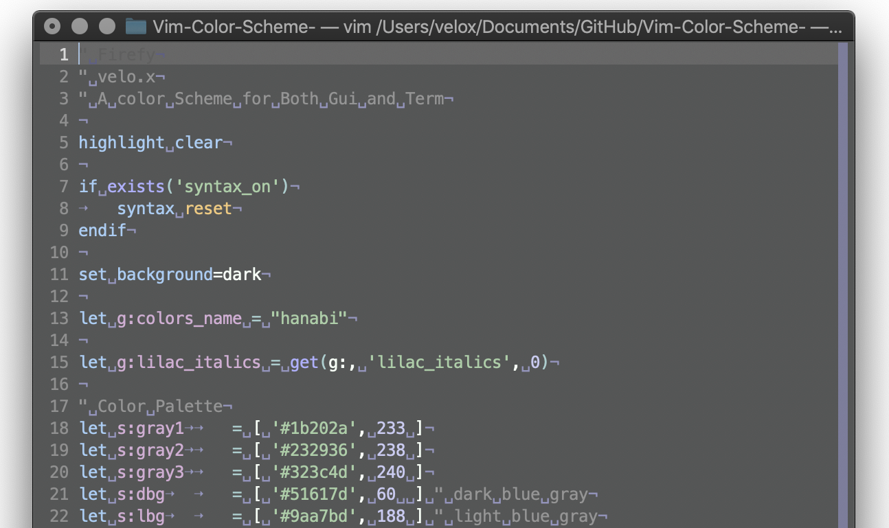
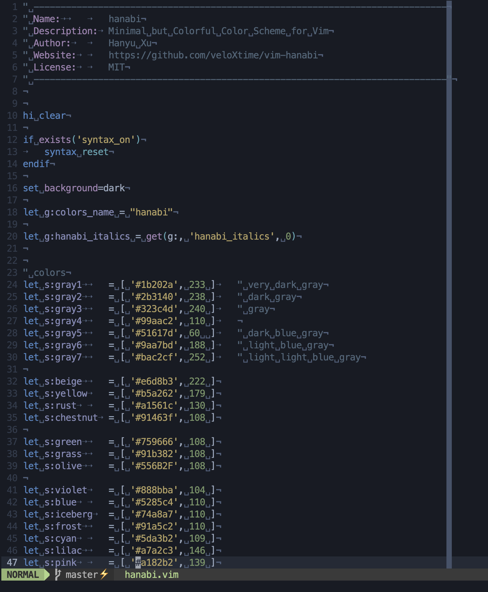

# Vim Color Scheme firefly

Work in both GUI and Terminal.

## Screenshot


Format: 


Format: 

## Usage

1. Clone firefly.vim to `~/.vim/colors/`.

2. add the following line to your .vimrc file. 

```vim
colorscheme amino 
```

## License

MIT license

